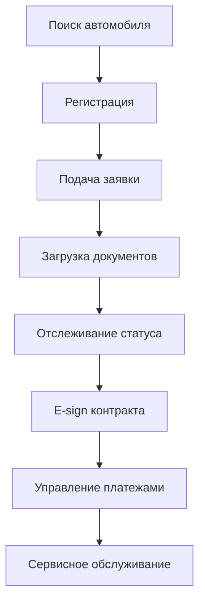
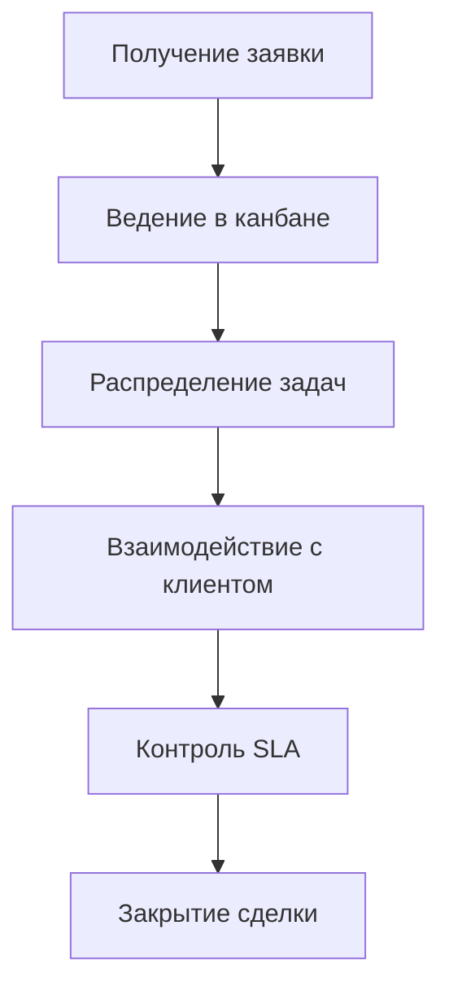
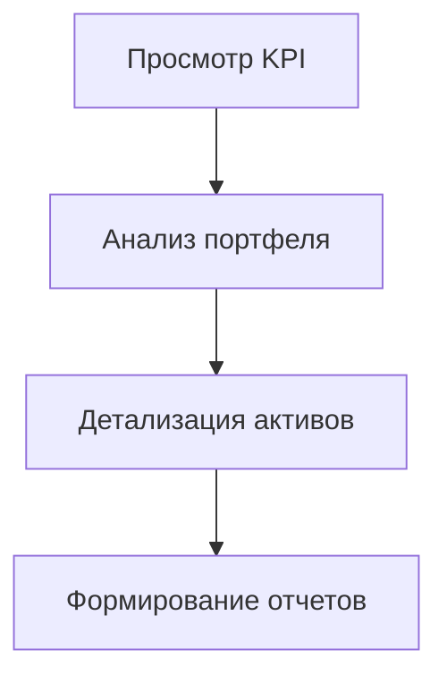
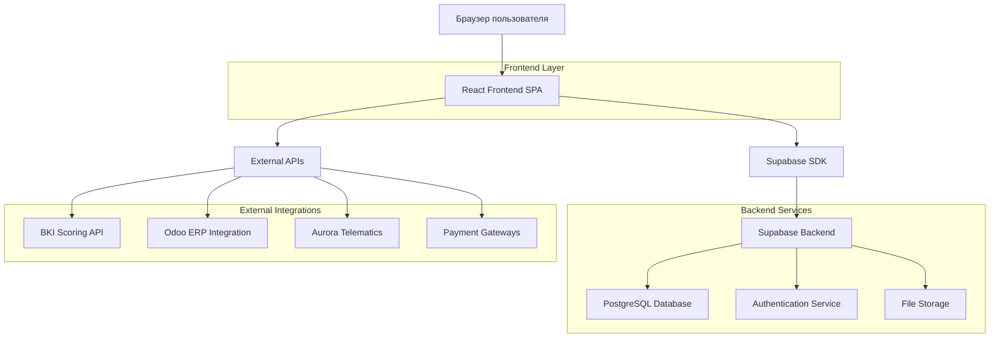
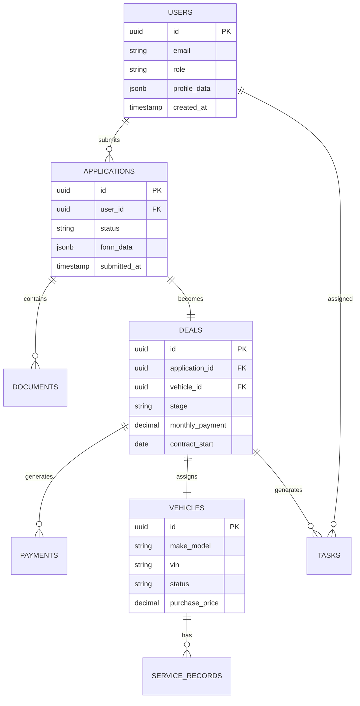

# Fast Lease — Комплексная документация продукта

## 1. Обзор продукта

**Fast Lease** — это цифровая экосистема лизинга автомобилей класса премиум/люкс для рынка ОАЭ, которая покрывает полный путь клиента от подбора автомобиля до выкупа и обслуживает все экосистемные роли: клиенты, операционные менеджеры, администраторы и инвесторы.

- **Проблема:** Фрагментированные процессы лизинга требуют прозрачности, быстрого онбординга и надежности при взаимодействии с банками, страховыми и инвесторами
- **Решение:** Единая цифровая платформа с персонализированными панелями управления, автоматизированными процессами и прозрачной аналитикой
- **Целевая аудитория:** High Net Worth клиенты, экспаты в ОАЭ, операционные команды, инвесторы

## 2. Основные функции

### 2.1 Пользовательские роли

| Роль | Метод регистрации | Основные права |
|------|-------------------|----------------|
| Гость | Без регистрации | Просмотр каталога, подача заявки |
| Заявитель | Email регистрация | Подача заявки, отслеживание статуса |
| Клиент | Активация договора | Управление платежами, сервисом, поддержкой |
| Операционный специалист | Корпоративный аккаунт | Обработка заявок, управление задачами |
| Операционный менеджер | Корпоративный аккаунт | Контроль пайплайна, SLA, команды |
| Администратор | Системный доступ | Управление настройками, правами, интеграциями |
| Инвестор | Приглашение | Просмотр портфеля, отчетности, аналитики |

### 2.2 Модульная структура

Платформа состоит из следующих основных страниц:

1. **Публичная зона**: лендинг, каталог автомобилей, поток заявки, авторизация
2. **Клиентский кабинет**: дашборд, платежи, управление автомобилем, поддержка, реферальная программа
3. **Операционная панель**: дашборд, задачи, сделки, клиенты, автопарк
4. **Инвесторский модуль**: дашборд, портфель, детализация активов, отчеты
5. **Административная панель**: управление процессами, пользователями, интеграциями

### 2.3 Детализация функций по страницам

| Страница | Модуль | Описание функций |
|----------|--------|------------------|
| Лендинг | Герой-секция | Презентация продукта, CTA для лидогенерации, преимущества, отзывы |
| Каталог | Фильтры и карточки | Фильтрация по классу/сроку/бюджету, сравнение моделей, калькулятор платежей |
| Заявка | Многошаговый мастер | Сбор данных, загрузка документов, проверка качества, e-signature |
| Клиентский дашборд | Статус и KPI | Таймлайн сделки, уведомления, ближайшие платежи, быстрые действия |
| Платежи | История и управление | График платежей, множественные способы оплаты, выгрузка документов |
| Мой автомобиль | Сервис и телематика | Статусы обслуживания, загрузка фото, интеграция с телематикой |
| Операционные задачи | Канбан-доска | Drag-n-drop задач, автоматические задачи от систем, SLA мониторинг |
| Сделки | Пайплайн управление | Канбан стадий, табличный вид, быстрые действия, интеграция с ERP |
| Инвесторский портфель | Аналитика активов | Фильтры по доходности, drill-down в активы, симуляторы ROI |

## 3. Основные пользовательские сценарии

### Сценарий клиента:


### Сценарий операционного менеджера:


### Сценарий инвестора:


## 4. Дизайн пользовательского интерфейса

### 4.1 Стиль дизайна

- **Основные цвета:** 
  - Первичный: #2563eb (синий)
  - Вторичный: #f5f6f8 (светло-серый фон)
  - Акцент: #15803d (зеленый для успеха)
  - Предупреждение: #a16207 (оранжевый)
  - Ошибка: #b91c1c (красный)

- **Типографика:** Geist Sans (основной), Inter (запасной), размеры от 0.75rem до 2rem
- **Стиль кнопок:** Минималистичный, прямые углы или минимальное скругление, без лишних теней
- **Макет:** Фиксированная боковая панель (18rem), фиксированный заголовок (5rem), адаптивная сетка
- **Иконки:** Lucide Icons (SVG), консистентный стиль

### 4.2 Обзор дизайна страниц

| Страница | Модуль | UI элементы |
|----------|--------|-------------|
| Лендинг | Герой-секция | Градиентный фон, крупная типографика, CTA кнопки, карточки преимуществ |
| Каталог | Фильтры | Боковая панель фильтров, сетка карточек, модальные окна сравнения |
| Дашборд | Виджеты KPI | Карточки с метриками, графики Chart.js, таймлайн компоненты |
| Канбан | Задачи | SortableJS drag-n-drop, цветовое кодирование статусов, модальные формы |
| Таблицы | Данные | Полосатые строки, сортировка, пагинация, быстрые действия |

### 4.3 Адаптивность

- **Desktop-first подход** с адаптацией под мобильные устройства
- **Breakpoints:** 1024px (планшеты), 768px (мобильные)
- **Мобильная навигация:** Скрытая боковая панель с burger-меню
- **Touch оптимизация:** Увеличенные области касания, swipe жесты
- **PWA готовность:** Offline доступ к ключевым данным

## 5. Техническая архитектура

### 5.1 Архитектурная диаграмма



### 5.2 Технологический стек

- **Frontend:** React@18 + TypeScript + Tailwind CSS + Vite
- **Backend:** Supabase (PostgreSQL + Auth + Storage)
- **UI Components:** shadcn/ui + Lucide Icons
- **Charts:** Chart.js для аналитики и дашбордов
- **Interactivity:** SortableJS для канбан досок
- **State Management:** React Query + Zustand
- **Routing:** React Router v6

### 5.3 Определение маршрутов

| Маршрут | Назначение |
|---------|------------|
| / | Главная страница с каталогом |
| /catalog/:vehicleId | Детальная страница автомобиля |
| /apply/* | Поток подачи заявки |
| /login | Страница авторизации |
| /client/* | Клиентский кабинет |
| /ops/* | Операционная панель |
| /admin/* | Административная панель |
| /investor/* | Инвесторский модуль |

### 5.4 API определения

#### Аутентификация
```
POST /auth/login
```
Request:
| Параметр | Тип | Обязательный | Описание |
|----------|-----|--------------|----------|
| email | string | true | Email пользователя |
| password | string | true | Пароль |

Response:
| Параметр | Тип | Описание |
|----------|-----|----------|
| access_token | string | JWT токен доступа |
| user | object | Данные пользователя |

#### Управление заявками
```
POST /api/applications
GET /api/applications/:id
PUT /api/applications/:id/status
```

#### Управление платежами
```
GET /api/payments/:clientId
POST /api/payments/process
```

### 5.5 Модель данных



### 5.6 DDL для основных таблиц

```sql
-- Пользователи
CREATE TABLE users (
    id UUID PRIMARY KEY DEFAULT gen_random_uuid(),
    email VARCHAR(255) UNIQUE NOT NULL,
    role VARCHAR(50) NOT NULL CHECK (role IN ('client', 'ops_specialist', 'ops_manager', 'admin', 'investor')),
    profile_data JSONB DEFAULT '{}',
    created_at TIMESTAMP WITH TIME ZONE DEFAULT NOW()
);

-- Заявки
CREATE TABLE applications (
    id UUID PRIMARY KEY DEFAULT gen_random_uuid(),
    user_id UUID REFERENCES users(id),
    status VARCHAR(50) DEFAULT 'draft',
    form_data JSONB DEFAULT '{}',
    submitted_at TIMESTAMP WITH TIME ZONE,
    created_at TIMESTAMP WITH TIME ZONE DEFAULT NOW()
);

-- Сделки
CREATE TABLE deals (
    id UUID PRIMARY KEY DEFAULT gen_random_uuid(),
    application_id UUID REFERENCES applications(id),
    vehicle_id UUID REFERENCES vehicles(id),
    stage VARCHAR(50) DEFAULT 'application',
    monthly_payment DECIMAL(10,2),
    contract_start DATE,
    created_at TIMESTAMP WITH TIME ZONE DEFAULT NOW()
);

-- Автомобили
CREATE TABLE vehicles (
    id UUID PRIMARY KEY DEFAULT gen_random_uuid(),
    make_model VARCHAR(255) NOT NULL,
    vin VARCHAR(17) UNIQUE,
    status VARCHAR(50) DEFAULT 'available',
    purchase_price DECIMAL(12,2),
    specifications JSONB DEFAULT '{}',
    created_at TIMESTAMP WITH TIME ZONE DEFAULT NOW()
);

-- Индексы для производительности
CREATE INDEX idx_applications_user_id ON applications(user_id);
CREATE INDEX idx_applications_status ON applications(status);
CREATE INDEX idx_deals_stage ON deals(stage);
CREATE INDEX idx_vehicles_status ON vehicles(status);

-- Права доступа Supabase
GRANT SELECT ON users TO anon;
GRANT ALL PRIVILEGES ON users TO authenticated;
GRANT SELECT ON applications TO anon;
GRANT ALL PRIVILEGES ON applications TO authenticated;
GRANT ALL PRIVILEGES ON deals TO authenticated;
GRANT ALL PRIVILEGES ON vehicles TO authenticated;
```

## 6. Интеграции и внешние сервисы

### 6.1 Ключевые интеграции

- **ERP (Odoo):** Двусторонняя синхронизация договоров, платежей, остатков
- **Скоринг (BKI):** REST API для кредитных проверок, SLA 2 минуты
- **Телематика (Aurora):** Данные по маршрутам, пробегу, состоянию автомобиля
- **Платежные шлюзы:** Network International для автодебета в ОАЭ
- **Документооборот:** S3-совместимое хранилище в регионе ОАЭ
- **Уведомления:** SMS/Email провайдеры, push через PWA

### 6.2 Мониторинг интеграций

Административная панель включает мониторинг:
- Статус подключений (Online/Warning/Offline)
- Latency и время ответа
- Логи запросов и ошибок
- SLA метрики по каждой интеграции

## 7. Безопасность и соответствие требованиям

### 7.1 Безопасность

- **Аутентификация:** Supabase Auth с MFA поддержкой
- **Авторизация:** Row Level Security (RLS) в PostgreSQL
- **Шифрование:** TLS 1.3 для передачи, AES-256 для хранения
- **Аудит:** Логирование всех действий с PII данными
- **Соответствие:** SOC2, GDPR-aligned процессы

### 7.2 Требования соответствия

- **Central Bank UAE:** Соблюдение финансовых регуляций
- **E-signature:** Юридически значимые подписи (DocuSign UAE)
- **KYC/AML:** Автоматизированные проверки через BKI
- **Хранение данных:** Локализация в регионе ОАЭ

## 8. Производительность и масштабируемость

### 8.1 Целевые метрики

- **TTFB:** < 500ms для SPA
- **LCP:** < 2.5s на 4G соединении
- **Uptime:** 99.5% для клиентских интерфейсов
- **Concurrent users:** До 1000 одновременных пользователей

### 8.2 Оптимизации

- **Code splitting:** Lazy loading модулей по ролям
- **Caching:** Redis для часто запрашиваемых данных
- **CDN:** Статические ресурсы через CloudFlare
- **Database:** Индексирование и партиционирование

## 9. План развертывания и релизов

### 9.1 Этапы релизов

1. **MVP (3 месяца):**
   - Публичный каталог и поток заявки
   - Базовый клиентский дашборд
   - Операционный канбан
   - Интеграция с Odoo/BKI

2. **Beta (6 месяцев):**
   - Полный клиентский функционал
   - Автоматизация задач
   - Мониторинг интеграций
   - Базовые инвесторские отчеты

3. **GA (9-12 месяцев):**
   - Полный инвесторский модуль
   - Конфигурируемые BPMN
   - Телематическая интеграция
   - PWA и мобильная оптимизация

### 9.2 Критерии успеха

- **Конверсия заявок:** ≥ 35%
- **Время обработки:** < 4 часа от подачи до решения
- **On-Time Activations:** ≥ 95%
- **NPS клиентов:** ≥ 60
- **SLA нарушения:** ≤ 3% от тикетов поддержки

## 10. Риски и митигация

### 10.1 Технические риски

- **Интеграционные зависимости:** Буферизация, очереди, graceful degradation
- **Производительность БД:** Мониторинг запросов, оптимизация индексов
- **Безопасность данных:** Регулярные аудиты, penetration testing

### 10.2 Бизнес риски

- **Принятие пользователями:** User testing на каждом этапе
- **Соответствие регуляциям:** Консультации с юристами ОАЭ
- **Масштабирование:** Архитектура с учетом роста нагрузки

## 11. Мониторинг и аналитика

### 11.1 Ключевые метрики

- **Бизнес KPI:** Конверсии, время цикла, доходность
- **Технические метрики:** Uptime, response time, error rate
- **Пользовательский опыт:** Page views, session duration, bounce rate

### 11.2 Инструменты мониторинга

- **APM:** Supabase встроенная аналитика
- **Логирование:** Структурированные логи в JSON
- **Алерты:** Настраиваемые уведомления по SLA
- **Дашборды:** Real-time метрики для каждой роли

## 12. Заключение

Данная комплексная документация обеспечивает полное техническое описание платформы Fast Lease, интегрируя функциональные требования, архитектуру навигации и принципы пользовательского опыта. Документ служит единым источником правды для всех участников разработки и гарантирует соответствие техническим спецификациям и бизнес-требованиям.

Следующий этап — создание детализированного плана задач для реализации описанной архитектуры.