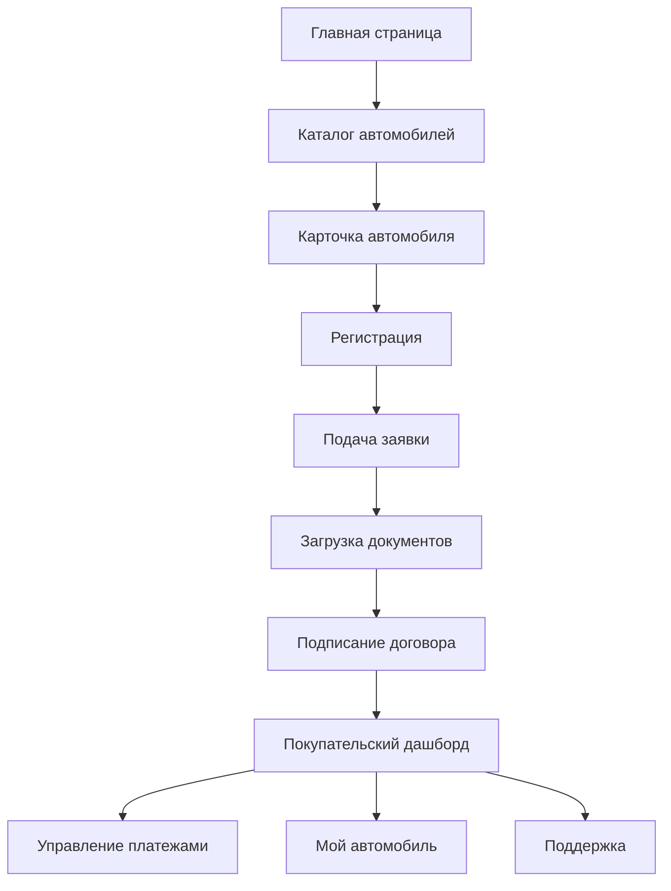
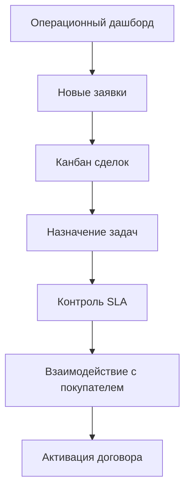
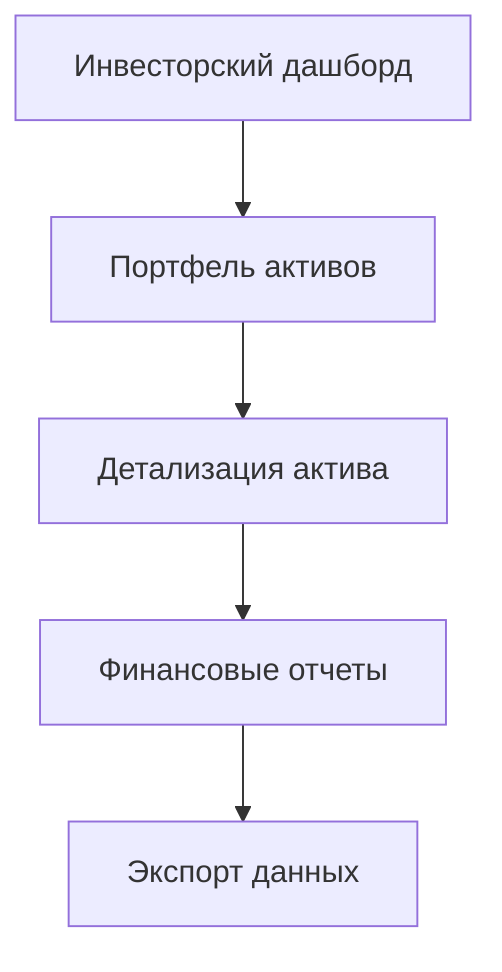

# Fast Lease — Комплексные требования к продукту

> **🚨 КРИТИЧЕСКИ ВАЖНО: ИСПОЛЬЗОВАНИЕ ПРОТОТИПА /beta/**
> 
> **ОБЯЗАТЕЛЬНОЕ ТРЕБОВАНИЕ**: Проект ДОЛЖЕН строиться исключительно на основе существующего прототипа в папке `/beta/`, а НЕ создаваться с нуля!
> 
> **Ключевые принципы:**
> - 📁 **Прототип `/beta/` — ЕДИНСТВЕННЫЙ источник истины** для UI/UX и функциональности
> - 🎨 **Точное воспроизведение**: Все страницы, компоненты, стили, структура данных должны точно копировать прототип
> - 🔄 **Только миграция**: Нельзя создавать новый дизайн или архитектуру — только перенос на современный стек
> - ⚠️ **Причина требования**: Предыдущие проекты ошибочно создавались с нуля вместо использования готового прототипа
> 
> **Что использовать из прототипа:**
> - Все HTML-страницы как референс для компонентов React
> - CSS стили из `/beta/assets/style.css` и `/beta/assets/linear.css`
> - JavaScript компоненты из `/beta/components/`
> - Структуру данных из mock-объектов
> - Навигацию и пользовательские сценарии
> 
> **Результат**: Современная React/Next.js версия с идентичным UX и функциональностью прототипа

## 1. Обзор продукта

Fast Lease — это цифровая экосистема лизинга автомобилей класса премиум/люкс для рынка ОАЭ, представляющая собой стандартный веб-сервис с серверным рендерингом. Платформа покрывает полный путь покупателя от подбора автомобиля до выкупа и обслуживает все экосистемные роли: покупатели, операционные менеджеры, администраторы и инвесторы.

Продукт решает проблему фрагментированности процессов лизинга, обеспечивая прозрачность, быстрый онбординг и надежность при взаимодействии с банками, страховыми компаниями и инвесторами.

## 2. Основные функции

### 2.1 Пользовательские роли

| Роль | Метод регистрации | Основные права |
|------|-------------------|----------------|
| Гость | Без регистрации | Просмотр каталога, подача заявки |
| Заявитель | Email регистрация | Подача заявки, отслеживание статуса |
| Покупатель | Активация договора | Управление платежами, сервисом, поддержкой |
| Операционный специалист | Корпоративный аккаунт | Обработка заявок, управление задачами |
| Операционный менеджер | Корпоративный аккаунт | Контроль пайплайна, SLA, команды |
| Финансовый менеджер | Корпоративный аккаунт | Управление платежами, отчетностью |
| Администратор системы | Корпоративный аккаунт | Настройки системы, права, интеграции |
| Инвестор | Приглашение | Просмотр портфеля, отчетов, активов |

### 2.2 Модульная структура

Система состоит из следующих основных страниц:

1. **Главная страница**: каталог автомобилей, навигация, информация о компании
2. **Страницы автомобилей**: детальная информация, калькулятор, условия лизинга
3. **Поток заявки**: регистрация, профиль, документы, подписание
4. **Покупательский кабинет**: дашборд, платежи, автомобиль, поддержка, рефералы
5. **Операционная панель**: дашборд, задачи, сделки, покупатели, автопарк
6. **Административная панель**: BPM, пользователи, интеграции
7. **Инвесторский кабинет**: дашборд, портфель, активы, отчеты

### 2.3 Детализация страниц

| Страница | Модуль | Описание функций |
|----------|--------|------------------|
| Главная страница | Каталог | Отображение доступных автомобилей с фильтрами по классу, цене, сроку лизинга |
| Главная страница | Навигация | Меню с переходами на все основные разделы, поиск |
| Главная страница | Информационные блоки | О компании, преимущества, отзывы, контакты |
| Карточка автомобиля | Галерея | Фотографии автомобиля, 360° обзор |
| Карточка автомобиля | Характеристики | Технические данные, комплектация |
| Карточка автомобиля | Калькулятор | Расчет ежемесячных платежей, общей стоимости |
| Заявка - Регистрация | Форма данных | Сбор персональной информации, контактов |
| Заявка - Документы | Загрузка файлов | Паспорт, права, справки о доходах с валидацией |
| Заявка - Подписание | E-signature | Электронная подпись договора |
| Покупатель - Дашборд | Статус сделки | Таймлайн этапов, уведомления, следующие шаги |
| Покупатель - Платежи | График платежей | История, статусы, способы оплаты |
| Покупатель - Автомобиль | Информация об авто | Статус сервиса, документы, телематика |
| Покупатель - Поддержка | Тикет-система | Создание заявок, чат, FAQ |
| Операции - Дашборд | KPI панель | Метрики активации, цикла, автоматизации |
| Операции - Задачи | Канбан доска | Управление задачами с drag-n-drop |
| Операции - Сделки | Пайплайн сделок | Канбан стадий от заявки до активации |
| Администрирование - BPM | Процессы | Управление бизнес-процессами, версионирование |
| Администрирование - Пользователи | Управление ролями | RBAC, MFA, права доступа |
| Инвестор - Дашборд | Портфель KPI | AUM, доходность, просроченные платежи |
| Инвестор - Активы | Детализация | Финансовые графики, сервисная история |

## 3. Основные пользовательские сценарии

### Сценарий покупателя:

### Сценарий операционного менеджера:

### Сценарий инвестора:

## 4. Дизайн пользовательского интерфейса

### 4.1 Стиль дизайна

- **Основные цвета**: #000000 (черный), #FFFFFF (белый), #F5F5F5 (светло-серый)
- **Акцентные цвета**: #0070F3 (синий Vercel), #FF0080 (розовый для важных действий)
- **Стиль кнопок**: Минималистичный, прямые углы или минимальное скругление
- **Шрифт**: Geist Sans (основной), Inter (запасной)
- **Размеры шрифта**: 14px (основной), 16px (заголовки), 12px (вспомогательный)
- **Стиль макета**: Карточный дизайн, верхняя навигация, боковые панели для админки
- **Иконки**: Lucide Icons в SVG формате

### 4.2 Обзор дизайна страниц

| Страница | Модуль | UI элементы |
|----------|--------|-------------|
| Главная | Каталог | Сетка карточек автомобилей, фильтры в боковой панели, пагинация |
| Главная | Навигация | Горизонтальное меню, логотип слева, кнопки входа/регистрации справа |
| Карточка авто | Галерея | Основное изображение с миниатюрами, кнопки переключения |
| Карточка авто | Калькулятор | Слайдеры для срока и первоначального взноса, результат справа |
| Заявка | Форма | Многошаговый мастер с прогресс-баром, валидация полей |
| Покупатель - Дашборд | Статус | Горизонтальный таймлайн, карточки с KPI, уведомления |
| Покупатель - Платежи | Таблица | Список платежей с фильтрами, кнопки оплаты |
| Операции - Канбан | Доска | Колонки статусов, карточки задач с drag-n-drop |
| Администрирование | Формы | Табличные данные, модальные окна для редактирования |
| Инвестор - Дашборд | Графики | Chart.js диаграммы, KPI виджеты, таблицы активов |

### 4.3 Адаптивность

- **Desktop-first** подход с адаптацией под мобильные устройства
- **Breakpoints**: 1200px (desktop), 768px (tablet), 480px (mobile)
- **Мобильная навигация**: Скрытое боковое меню с гамбургер-кнопкой
- **Touch-оптимизация**: Увеличенные области нажатия, свайпы для карусели
- **PWA поддержка**: Для покупательского кабинета (офлайн доступ к платежам)