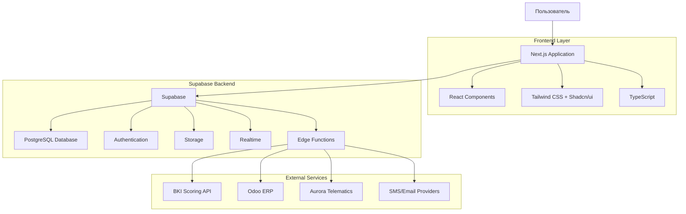
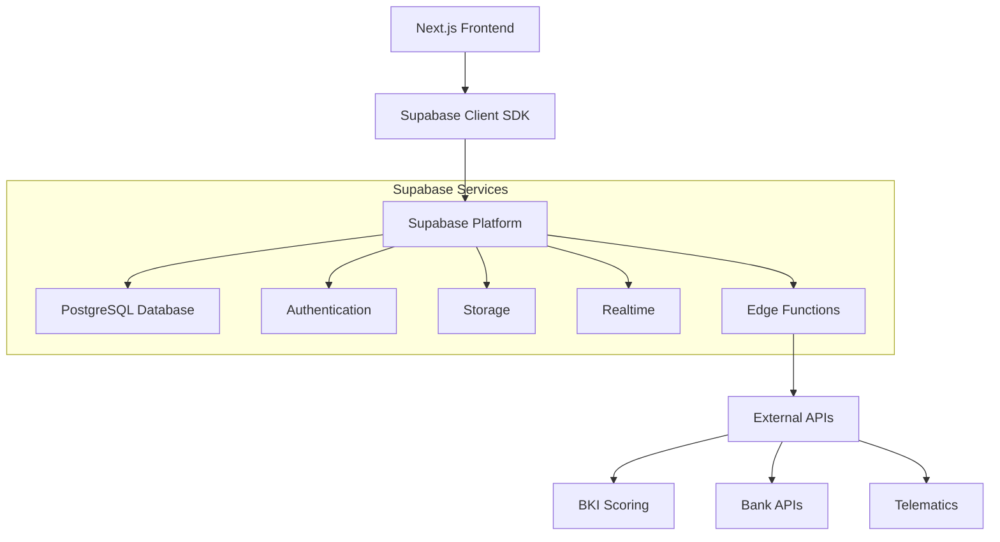

# Fast Lease — Техническая архитектура

> **🚨 КРИТИЧЕСКИ ВАЖНО: ИСПОЛЬЗОВАНИЕ ПРОТОТИПА /beta/**
>
> **ОБЯЗАТЕЛЬНОЕ ТРЕБОВАНИЕ**: Техническая реализация ДОЛЖНА строиться исключительно на основе существующего прототипа в папке `/beta/`, а НЕ создаваться с нуля!
>
> **Ключевые принципы:**
>
> * 📁 **Прототип** **`/beta/`** **— ЕДИНСТВЕННЫЙ источник истины** для архитектуры и функциональности
>
> * 🎨 **Точное воспроизведение**: Все компоненты, API, структура данных должны точно копировать прототип
>
> * 🔄 **Только миграция**: Нельзя создавать новую архитектуру — только перенос на современный стек
>
> * ⚠️ **Причина требования**: Предыдущие проекты ошибочно создавались с нуля вместо использования готового прототипа
>
> **Что использовать из прототипа:**
>
> * Структуру страниц и компонентов из `/beta/`
>
> * JavaScript логику из `/beta/components/` и `/beta/assets/shared.js`
>
> * Модели данных из mock-объектов в HTML файлах
>
> * API endpoints, определенные в прототипе
>
> * Пользовательские сценарии и навигацию
>
> **Результат**: Современная серверная архитектура с идентичной функциональностью прототипа

## 1. Архитектурный дизайн



## 2. Описание технологий

* **Frontend**: Next.js 14 с App Router + React 18
* **Styling**: Tailwind CSS + Shadcn/ui компоненты
* **Language**: TypeScript для строгой типизации
* **Backend**: Supabase (PostgreSQL + Auth + Storage + Realtime)
* **Authentication**: Supabase Auth с MFA поддержкой
* **Storage**: Supabase Storage для файлов и документов
* **Realtime**: Supabase Realtime для живых обновлений
* **API**: Supabase Edge Functions для серверной логики
* **Charts**: Chart.js для графиков и аналитики
* **Drag & Drop**: SortableJS для канбан досок

## 3. Определения маршрутов

| Маршрут              | Назначение                               |
| -------------------- | ---------------------------------------- |
| /                    | Главная страница с каталогом автомобилей |
| /cars/:id            | Детальная страница автомобиля            |
| /pricing             | Тарифы и условия лизинга                 |
| /login               | Страница входа в систему                 |
| /register            | Регистрация нового пользователя          |
| /apply/start         | Начало подачи заявки                     |
| /apply/profile       | Заполнение профиля заявителя             |
| /apply/documents     | Загрузка документов                      |
| /apply/summary       | Подтверждение и подписание заявки        |
| /apply/status        | Статус обработки заявки                  |
| /client/dashboard    | Дашборд клиента                          |
| /client/invoices     | Управление платежами                     |
| /client/vehicle      | Информация об автомобиле                 |
| /client/support      | Система поддержки                        |
| /client/referrals    | Реферальная программа                    |
| /ops/dashboard       | Операционный дашборд                     |
| /ops/tasks           | Управление задачами                      |
| /ops/deals           | Канбан сделок                            |
| /ops/clients         | Управление клиентами                     |
| /ops/cars            | Управление автопарком                    |
| /admin/bpm           | Управление бизнес-процессами             |
| /admin/users         | Управление пользователями                |
| /admin/integrations  | Мониторинг интеграций                    |
| /investor/dashboard  | Инвесторский дашборд                     |
| /investor/portfolio  | Портфель активов                         |
| /investor/assets/:id | Детализация актива                       |
| /investor/reports    | Генерация отчетов                        |

## 4. API определения

### 4.1 Supabase API интеграция

**Аутентификация через Supabase Auth**

```typescript
// Supabase Client SDK
import { createClient } from '@supabase/supabase-js'

const supabase = createClient(url, key)

// Вход в систему
await supabase.auth.signInWithPassword({
  email: 'user@example.com',
  password: 'password'
})
```

**Работа с данными через Supabase**

```typescript
// Получение списка автомобилей
const { data: vehicles } = await supabase
  .from('vehicles')
  .select('*')
  .eq('status', 'available')

// Создание заявки
const { data: application } = await supabase
  .from('applications')
  .insert({
    user_id: user.id,
    vehicle_id: vehicleId,
    status: 'draft'
  })

// Загрузка документов в Supabase Storage
const { data: file } = await supabase.storage
  .from('documents')
  .upload(`applications/${applicationId}/passport.pdf`, file)
```

**Realtime подписки**

```typescript
// Отслеживание изменений статуса заявки
supabase
  .channel('application-updates')
  .on('postgres_changes', {
    event: 'UPDATE',
    schema: 'public',
    table: 'applications',
    filter: `user_id=eq.${userId}`
  }, (payload) => {
    // Обновление UI в реальном времени
    updateApplicationStatus(payload.new)
  })
  .subscribe()
```

**Edge Functions для серверной логики**

```typescript
// /supabase/functions/process-application/index.ts
import { serve } from 'https://deno.land/std@0.168.0/http/server.ts'

serve(async (req) => {
  const { applicationId } = await req.json()
  
  // Вызов внешних API (BKI, банки)
  const scoringResult = await callBKIAPI(applicationData)
  
  // Обновление статуса в БД
  await supabase
    .from('applications')
    .update({ 
      status: 'processing',
      scoring_result: scoringResult 
    })
    .eq('id', applicationId)
    
  return new Response(JSON.stringify({ success: true }))
})
```

## 5. Архитектура Supabase



## 6. Модель данных

### 6.1 Определение модели данных

```mermaid
erDiagram
    USERS ||--o{ APPLICATIONS : creates
    USERS ||--o{ USER_SESSIONS : has
    USERS ||--o{ USER_DOCUMENTS : uploads
    USERS ||--o{ AUDIT_LOGS : generates
    
    APPLICATIONS ||--|| VEHICLES : for
    APPLICATIONS ||--o{ APPLICATION_DOCUMENTS : has
    APPLICATIONS ||--o{ APPLICATION_HISTORY : tracks
    APPLICATIONS ||--|| DEALS : becomes
    
    VEHICLES ||--o{ VEHICLE_SPECIFICATIONS : has
    VEHICLES ||--o{ VEHICLE_IMAGES : has
    VEHICLES ||--o{ VEHICLE_MAINTENANCE : requires
    
    DEALS ||--o{ INVOICES : generates
    DEALS ||--o{ PAYMENTS : receives
    DEALS ||--o{ DEAL_EVENTS : tracks
    DEALS ||--|| INSURANCE_POLICIES : includes
    
    INVOICES ||--o{ PAYMENT_TRANSACTIONS : paid_by
    
    INVESTORS ||--o{ INVESTMENT_PORTFOLIOS : owns
    INVESTMENT_PORTFOLIOS ||--o{ PORTFOLIO_ASSETS : contains
    PORTFOLIO_ASSETS ||--|| DEALS : references
    
    SYSTEM_SETTINGS ||--o{ INTEGRATION_CONFIGS : configures
    INTEGRATION_CONFIGS ||--o{ API_LOGS : logs

    USERS {
        uuid id PK
        string email UK
        string password_hash
        string first_name
        string last_name
        string phone UK
        string emirates_id UK
        string passport_number
        string nationality
        string residency_status
        jsonb address
        string role
        string status
        jsonb preferences
        jsonb kyc_data
        timestamp email_verified_at
        timestamp phone_verified_at
        timestamp created_at
        timestamp updated_at
        timestamp deleted_at
    }
    
    USER_SESSIONS {
        uuid id PK
        uuid user_id FK
        string session_token UK
        string refresh_token UK
        string ip_address
        string user_agent
        jsonb device_info
        timestamp expires_at
        timestamp last_activity
        timestamp created_at
    }
    
    VEHICLES {
        uuid id PK
        string vin UK
        string make
        string model
        string variant
        integer year
        string body_type
        string fuel_type
        string transmission
        decimal engine_capacity
        integer mileage
        string color_exterior
        string color_interior
        decimal purchase_price
        decimal current_value
        decimal monthly_lease_rate
        decimal residual_value
        string status
        jsonb features
        jsonb location_data
        timestamp acquired_at
        timestamp created_at
        timestamp updated_at
    }
    
    VEHICLE_SPECIFICATIONS {
        uuid id PK
        uuid vehicle_id FK
        string category
        string specification_key
        string specification_value
        string unit
        integer sort_order
    }
    
    APPLICATIONS {
        uuid id PK
        string application_number UK
        uuid user_id FK
        uuid vehicle_id FK
        string status
        decimal requested_amount
        integer term_months
        decimal down_payment
        decimal monthly_payment
        decimal interest_rate
        jsonb personal_info
        jsonb financial_info
        jsonb employment_info
        jsonb references_info
        jsonb scoring_results
        jsonb risk_assessment
        string assigned_to
        timestamp submitted_at
        timestamp approved_at
        timestamp rejected_at
        string rejection_reason
        timestamp created_at
        timestamp updated_at
    }
    
    APPLICATION_DOCUMENTS {
        uuid id PK
        uuid application_id FK
        string document_type
        string document_category
        string original_filename
        string stored_filename
        string file_path
        string mime_type
        integer file_size
        string checksum
        string status
        jsonb verification_data
        timestamp uploaded_at
        timestamp verified_at
        string verified_by
    }
    
    DEALS {
        uuid id PK
        string deal_number UK
        uuid application_id FK
        uuid vehicle_id FK
        uuid client_id FK
        string status
        decimal principal_amount
        decimal total_amount
        decimal monthly_payment
        integer term_months
        decimal interest_rate
        decimal down_payment_amount
        decimal security_deposit
        decimal processing_fee
        date contract_start_date
        date contract_end_date
        date first_payment_date
        jsonb contract_terms
        jsonb insurance_details
        string assigned_account_manager
        timestamp activated_at
        timestamp completed_at
        timestamp created_at
        timestamp updated_at
    }
    
    INVOICES {
        uuid id PK
        string invoice_number UK
        uuid deal_id FK
        string invoice_type
        decimal amount
        decimal tax_amount
        decimal total_amount
        string currency
        date due_date
        date issue_date
        string status
        jsonb line_items
        jsonb tax_breakdown
        string payment_terms
        timestamp paid_at
        timestamp created_at
        timestamp updated_at
    }
    
    PAYMENT_TRANSACTIONS {
        uuid id PK
        string transaction_id UK
        uuid invoice_id FK
        uuid deal_id FK
        string payment_method
        string payment_provider
        decimal amount
        string currency
        string status
        jsonb provider_response
        jsonb metadata
        timestamp processed_at
        timestamp created_at
    }
    
    INSURANCE_POLICIES {
        uuid id PK
        string policy_number UK
        uuid deal_id FK
        string provider_name
        string policy_type
        decimal coverage_amount
        decimal premium_amount
        date policy_start_date
        date policy_end_date
        string status
        jsonb coverage_details
        jsonb claims_history
        timestamp created_at
        timestamp updated_at
    }
    
    INVESTORS {
        uuid id PK
        string investor_code UK
        string company_name
        string contact_person
        string email
        string phone
        jsonb address
        string investor_type
        decimal total_investment
        decimal available_funds
        string status
        jsonb compliance_data
        timestamp onboarded_at
        timestamp created_at
        timestamp updated_at
    }
    
    INVESTMENT_PORTFOLIOS {
        uuid id PK
        uuid investor_id FK
        string portfolio_name
        string portfolio_type
        decimal total_value
        decimal allocated_amount
        decimal available_amount
        jsonb risk_parameters
        jsonb performance_metrics
        timestamp created_at
        timestamp updated_at
    }
    
    AUDIT_LOGS {
        uuid id PK
        uuid user_id FK
        string entity_type
        uuid entity_id
        string action
        jsonb old_values
        jsonb new_values
        string ip_address
        string user_agent
        timestamp created_at
    }
    
    SYSTEM_SETTINGS {
        uuid id PK
        string setting_key UK
        string setting_category
        jsonb setting_value
        string description
        boolean is_encrypted
        timestamp updated_at
        string updated_by
    }
    
    INTEGRATION_CONFIGS {
        uuid id PK
        string integration_name UK
        string integration_type
        string endpoint_url
        jsonb authentication_config
        jsonb request_config
        jsonb response_mapping
        boolean is_active
        integer timeout_seconds
        integer retry_attempts
        timestamp last_sync_at
        timestamp created_at
        timestamp updated_at
    }
```



### 6.2 TypeScript интерфейсы

**Основные типы данных**

```typescript
// Пользователи и аутентификация
interface User {
  id: string;
  email: string;
  firstName: string;
  lastName: string;
  phone: string;
  emiratesId?: string;
  passportNumber?: string;
  nationality: string;
  residencyStatus: 'resident' | 'non_resident' | 'visitor';
  address: Address;
  role: UserRole;
  status: UserStatus;
  preferences: UserPreferences;
  kycData: KYCData;
  emailVerifiedAt?: Date;
  phoneVerifiedAt?: Date;
  createdAt: Date;
  updatedAt: Date;
}

interface Address {
  street: string;
  city: string;
  emirate: string;
  country: string;
  postalCode?: string;
  coordinates?: {
    latitude: number;
    longitude: number;
  };
}

interface KYCData {
  verificationLevel: 'basic' | 'enhanced' | 'premium';
  documentsVerified: string[];
  riskScore: number;
  sanctionsCheck: boolean;
  pepCheck: boolean;
  lastVerificationDate: Date;
}

// Автомобили и спецификации
interface Vehicle {
  id: string;
  vin: string;
  make: string;
  model: string;
  variant: string;
  year: number;
  bodyType: string;
  fuelType: string;
  transmission: string;
  engineCapacity: number;
  mileage: number;
  colorExterior: string;
  colorInterior: string;
  purchasePrice: number;
  currentValue: number;
  monthlyLeaseRate: number;
  residualValue: number;
  status: VehicleStatus;
  features: VehicleFeature[];
  specifications: VehicleSpecification[];
  images: VehicleImage[];
  locationData: LocationData;
  acquiredAt: Date;
  createdAt: Date;
  updatedAt: Date;
}

interface VehicleSpecification {
  id: string;
  vehicleId: string;
  category: string;
  specificationKey: string;
  specificationValue: string;
  unit?: string;
  sortOrder: number;
}

interface VehicleFeature {
  name: string;
  category: string;
  description?: string;
  isStandard: boolean;
}

// Заявки и документы
interface Application {
  id: string;
  applicationNumber: string;
  userId: string;
  vehicleId: string;
  status: ApplicationStatus;
  requestedAmount: number;
  termMonths: number;
  downPayment: number;
  monthlyPayment: number;
  interestRate: number;
  personalInfo: PersonalInfo;
  financialInfo: FinancialInfo;
  employmentInfo: EmploymentInfo;
  referencesInfo: ReferenceInfo[];
  scoringResults?: ScoringResults;
  riskAssessment?: RiskAssessment;
  assignedTo?: string;
  submittedAt?: Date;
  approvedAt?: Date;
  rejectedAt?: Date;
  rejectionReason?: string;
  createdAt: Date;
  updatedAt: Date;
}

interface PersonalInfo {
  firstName: string;
  lastName: string;
  dateOfBirth: Date;
  nationality: string;
  emiratesId?: string;
  passportNumber?: string;
  maritalStatus: string;
  dependents: number;
  address: Address;
  alternativeAddress?: Address;
}

interface FinancialInfo {
  monthlyIncome: number;
  additionalIncome?: number;
  monthlyExpenses: number;
  existingLoans: ExistingLoan[];
  bankStatements: BankStatement[];
  creditScore?: number;
  debtToIncomeRatio: number;
}

interface EmploymentInfo {
  employmentType: 'employed' | 'self_employed' | 'business_owner' | 'retired';
  companyName: string;
  position: string;
  workExperience: number;
  monthlyBasicSalary: number;
  monthlyAllowances: number;
  employerAddress: Address;
  employerContact: ContactInfo;
}

// Сделки и финансы
interface Deal {
  id: string;
  dealNumber: string;
  applicationId: string;
  vehicleId: string;
  clientId: string;
  status: DealStatus;
  principalAmount: number;
  totalAmount: number;
  monthlyPayment: number;
  termMonths: number;
  interestRate: number;
  downPaymentAmount: number;
  securityDeposit: number;
  processingFee: number;
  contractStartDate: Date;
  contractEndDate: Date;
  firstPaymentDate: Date;
  contractTerms: ContractTerms;
  insuranceDetails: InsuranceDetails;
  assignedAccountManager?: string;
  activatedAt?: Date;
  completedAt?: Date;
  createdAt: Date;
  updatedAt: Date;
}

interface Invoice {
  id: string;
  invoiceNumber: string;
  dealId: string;
  invoiceType: 'monthly_payment' | 'down_payment' | 'processing_fee' | 'late_fee' | 'insurance';
  amount: number;
  taxAmount: number;
  totalAmount: number;
  currency: string;
  dueDate: Date;
  issueDate: Date;
  status: InvoiceStatus;
  lineItems: InvoiceLineItem[];
  taxBreakdown: TaxBreakdown[];
  paymentTerms: string;
  paidAt?: Date;
  createdAt: Date;
  updatedAt: Date;
}

interface PaymentTransaction {
  id: string;
  transactionId: string;
  invoiceId: string;
  dealId: string;
  paymentMethod: PaymentMethod;
  paymentProvider: string;
  amount: number;
  currency: string;
  status: PaymentStatus;
  providerResponse: Record<string, any>;
  metadata: Record<string, any>;
  processedAt?: Date;
  createdAt: Date;
}

// Инвесторы и портфели
interface Investor {
  id: string;
  investorCode: string;
  companyName: string;
  contactPerson: string;
  email: string;
  phone: string;
  address: Address;
  investorType: 'individual' | 'institutional' | 'fund';
  totalInvestment: number;
  availableFunds: number;
  status: InvestorStatus;
  complianceData: ComplianceData;
  onboardedAt: Date;
  createdAt: Date;
  updatedAt: Date;
}

interface InvestmentPortfolio {
  id: string;
  investorId: string;
  portfolioName: string;
  portfolioType: string;
  totalValue: number;
  allocatedAmount: number;
  availableAmount: number;
  riskParameters: RiskParameters;
  performanceMetrics: PerformanceMetrics;
  createdAt: Date;
  updatedAt: Date;
}

// Системные типы
interface AuditLog {
  id: string;
  userId: string;
  entityType: string;
  entityId: string;
  action: string;
  oldValues?: Record<string, any>;
  newValues?: Record<string, any>;
  ipAddress: string;
  userAgent: string;
  createdAt: Date;
}

interface SystemSetting {
  id: string;
  settingKey: string;
  settingCategory: string;
  settingValue: Record<string, any>;
  description: string;
  isEncrypted: boolean;
  updatedAt: Date;
  updatedBy: string;
}

// Перечисления
type UserRole = 'client' | 'operator' | 'admin' | 'investor' | 'partner';
type UserStatus = 'active' | 'inactive' | 'suspended' | 'pending_verification';
type VehicleStatus = 'available' | 'reserved' | 'leased' | 'maintenance' | 'sold';
type ApplicationStatus = 'draft' | 'submitted' | 'under_review' | 'documents_pending' | 'approved' | 'rejected' | 'expired';
type DealStatus = 'active' | 'completed' | 'defaulted' | 'early_settlement' | 'terminated';
type InvoiceStatus = 'pending' | 'sent' | 'paid' | 'overdue' | 'cancelled';
type PaymentStatus = 'pending' | 'processing' | 'completed' | 'failed' | 'refunded';
type PaymentMethod = 'bank_transfer' | 'credit_card' | 'debit_card' | 'digital_wallet' | 'cash';
type InvestorStatus = 'active' | 'inactive' | 'suspended' | 'under_review';
```

### 6.3 Язык определения данных (DDL)

**Создание основных таблиц**

```sql
-- Пользователи
CREATE TABLE users (
    id UUID PRIMARY KEY DEFAULT gen_random_uuid(),
    email VARCHAR(255) UNIQUE NOT NULL,
    password_hash VARCHAR(255) NOT NULL,
    first_name VARCHAR(100) NOT NULL,
    last_name VARCHAR(100) NOT NULL,
    phone VARCHAR(20) UNIQUE,
    emirates_id VARCHAR(20) UNIQUE,
    passport_number VARCHAR(50),
    nationality VARCHAR(100) NOT NULL,
    residency_status VARCHAR(20) DEFAULT 'resident' CHECK (residency_status IN ('resident', 'non_resident', 'visitor')),
    address JSONB NOT NULL,
    role VARCHAR(20) DEFAULT 'client' CHECK (role IN ('client', 'operator', 'admin', 'investor', 'partner')),
    status VARCHAR(20) DEFAULT 'pending_verification' CHECK (status IN ('active', 'inactive', 'suspended', 'pending_verification')),
    preferences JSONB DEFAULT '{}',
    kyc_data JSONB DEFAULT '{}',
    email_verified_at TIMESTAMP WITH TIME ZONE,
    phone_verified_at TIMESTAMP WITH TIME ZONE,
    created_at TIMESTAMP WITH TIME ZONE DEFAULT NOW(),
    updated_at TIMESTAMP WITH TIME ZONE DEFAULT NOW(),
    deleted_at TIMESTAMP WITH TIME ZONE
);

-- Автомобили
CREATE TABLE vehicles (
    id UUID PRIMARY KEY DEFAULT gen_random_uuid(),
    vin VARCHAR(17) UNIQUE NOT NULL,
    make VARCHAR(100) NOT NULL,
    model VARCHAR(100) NOT NULL,
    variant VARCHAR(100),
    year INTEGER NOT NULL CHECK (year >= 2015 AND year <= EXTRACT(YEAR FROM NOW()) + 2),
    body_type VARCHAR(50) NOT NULL,
    fuel_type VARCHAR(30) NOT NULL,
    transmission VARCHAR(30) NOT NULL,
    engine_capacity DECIMAL(4,2),
    mileage INTEGER DEFAULT 0,
    color_exterior VARCHAR(50),
    color_interior VARCHAR(50),
    purchase_price DECIMAL(12,2) NOT NULL,
    current_value DECIMAL(12,2) NOT NULL,
    monthly_lease_rate DECIMAL(10,2) NOT NULL,
    residual_value DECIMAL(12,2) NOT NULL,
    status VARCHAR(20) DEFAULT 'available' CHECK (status IN ('available', 'reserved', 'leased', 'maintenance', 'sold')),
    features JSONB DEFAULT '[]',
    location_data JSONB DEFAULT '{}',
    acquired_at TIMESTAMP WITH TIME ZONE DEFAULT NOW(),
    created_at TIMESTAMP WITH TIME ZONE DEFAULT NOW(),
    updated_at TIMESTAMP WITH TIME ZONE DEFAULT NOW()
);

-- Заявки
CREATE TABLE applications (
    id UUID PRIMARY KEY DEFAULT gen_random_uuid(),
    application_number VARCHAR(20) UNIQUE NOT NULL,
    user_id UUID NOT NULL REFERENCES users(id) ON DELETE CASCADE,
    vehicle_id UUID NOT NULL REFERENCES vehicles(id),
    status VARCHAR(30) DEFAULT 'draft' CHECK (status IN ('draft', 'submitted', 'under_review', 'documents_pending', 'approved', 'rejected', 'expired')),
    requested_amount DECIMAL(12,2) NOT NULL,
    term_months INTEGER NOT NULL CHECK (term_months BETWEEN 12 AND 84),
    down_payment DECIMAL(12,2) NOT NULL,
    monthly_payment DECIMAL(10,2) NOT NULL,
    interest_rate DECIMAL(5,4) NOT NULL,
    personal_info JSONB NOT NULL,
    financial_info JSONB NOT NULL,
    employment_info JSONB NOT NULL,
    references_info JSONB DEFAULT '[]',
    scoring_results JSONB,
    risk_assessment JSONB,
    assigned_to UUID REFERENCES users(id),
    submitted_at TIMESTAMP WITH TIME ZONE,
    approved_at TIMESTAMP WITH TIME ZONE,
    rejected_at TIMESTAMP WITH TIME ZONE,
    rejection_reason TEXT,
    created_at TIMESTAMP WITH TIME ZONE DEFAULT NOW(),
    updated_at TIMESTAMP WITH TIME ZONE DEFAULT NOW()
);

-- Сделки
CREATE TABLE deals (
    id UUID PRIMARY KEY DEFAULT gen_random_uuid(),
    deal_number VARCHAR(20) UNIQUE NOT NULL,
    application_id UUID NOT NULL REFERENCES applications(id),
    vehicle_id UUID NOT NULL REFERENCES vehicles(id),
    client_id UUID NOT NULL REFERENCES users(id),
    status VARCHAR(20) DEFAULT 'active' CHECK (status IN ('active', 'completed', 'defaulted', 'early_settlement', 'terminated')),
    principal_amount DECIMAL(12,2) NOT NULL,
    total_amount DECIMAL(12,2) NOT NULL,
    monthly_payment DECIMAL(10,2) NOT NULL,
    term_months INTEGER NOT NULL,
    interest_rate DECIMAL(5,4) NOT NULL,
    down_payment_amount DECIMAL(12,2) NOT NULL,
    security_deposit DECIMAL(10,2) DEFAULT 0,
    processing_fee DECIMAL(8,2) DEFAULT 0,
    contract_start_date DATE NOT NULL,
    contract_end_date DATE NOT NULL,
    first_payment_date DATE NOT NULL,
    contract_terms JSONB NOT NULL,
    insurance_details JSONB NOT NULL,
    assigned_account_manager UUID REFERENCES users(id),
    activated_at TIMESTAMP WITH TIME ZONE,
    completed_at TIMESTAMP WITH TIME ZONE,
    created_at TIMESTAMP WITH TIME ZONE DEFAULT NOW(),
    updated_at TIMESTAMP WITH TIME ZONE DEFAULT NOW()
);

-- Индексы для производительности
CREATE INDEX idx_users_email ON users(email);
CREATE INDEX idx_users_role_status ON users(role, status);
CREATE INDEX idx_users_created_at ON users(created_at DESC);

CREATE INDEX idx_vehicles_make_model ON vehicles(make, model);
CREATE INDEX idx_vehicles_status ON vehicles(status);
CREATE INDEX idx_vehicles_price_range ON vehicles(monthly_lease_rate);

CREATE INDEX idx_applications_user_id ON applications(user_id);
CREATE INDEX idx_applications_status ON applications(status);
CREATE INDEX idx_applications_created_at ON applications(created_at DESC);
CREATE INDEX idx_applications_assigned_to ON applications(assigned_to);

CREATE INDEX idx_deals_client_id ON deals(client_id);
CREATE INDEX idx_deals_status ON deals(status);
CREATE INDEX idx_deals_contract_dates ON deals(contract_start_date, contract_end_date);

-- RLS (Row Level Security) политики
ALTER TABLE users ENABLE ROW LEVEL SECURITY;
ALTER TABLE applications ENABLE ROW LEVEL SECURITY;
ALTER TABLE deals ENABLE ROW LEVEL SECURITY;

-- Политики доступа
CREATE POLICY "Users can view own profile" ON users FOR SELECT USING (auth.uid() = id);
CREATE POLICY "Users can update own profile" ON users FOR UPDATE USING (auth.uid() = id);

CREATE POLICY "Users can view own applications" ON applications FOR SELECT USING (auth.uid() = user_id);
CREATE POLICY "Operators can view all applications" ON applications FOR SELECT USING (
    EXISTS (SELECT 1 FROM users WHERE id = auth.uid() AND role IN ('operator', 'admin'))
);

-- Права доступа для ролей
GRANT SELECT ON users TO anon;
GRANT ALL PRIVILEGES ON users TO authenticated;
GRANT ALL PRIVILEGES ON vehicles TO authenticated;
GRANT ALL PRIVILEGES ON applications TO authenticated;
GRANT ALL PRIVILEGES ON deals TO authenticated;

-- Функции и триггеры
CREATE OR REPLACE FUNCTION update_updated_at_column()
RETURNS TRIGGER AS $$
BEGIN
    NEW.updated_at = NOW();
    RETURN NEW;
END;
$$ language 'plpgsql';

CREATE TRIGGER update_users_updated_at BEFORE UPDATE ON users FOR EACH ROW EXECUTE FUNCTION update_updated_at_column();
CREATE TRIGGER update_vehicles_updated_at BEFORE UPDATE ON vehicles FOR EACH ROW EXECUTE FUNCTION update_updated_at_column();
CREATE TRIGGER update_applications_updated_at BEFORE UPDATE ON applications FOR EACH ROW EXECUTE FUNCTION update_updated_at_column();
CREATE TRIGGER update_deals_updated_at BEFORE UPDATE ON deals FOR EACH ROW EXECUTE FUNCTION update_updated_at_column();

-- Начальные данные для разработки
INSERT INTO users (email, password_hash, first_name, last_name, phone, nationality, address, role, status) VALUES
('admin@fastlease.ae', '$2b$10$example_hash', 'System', 'Administrator', '+971501234567', 'UAE', '{"street": "Sheikh Zayed Road", "city": "Dubai", "emirate": "Dubai", "country": "UAE"}', 'admin', 'active'),
('ops@fastlease.ae', '$2b$10$example_hash', 'Operations', 'Manager', '+971509876543', 'UAE', '{"street": "Business Bay", "city": "Dubai", "emirate": "Dubai", "country": "UAE"}', 'operator', 'active'),
('investor@fund.ae', '$2b$10$example_hash', 'Investment', 'Fund', '+971501111111', 'UAE', '{"street": "DIFC", "city": "Dubai", "emirate": "Dubai", "country": "UAE"}', 'investor', 'active');

INSERT INTO vehicles (vin, make, model, variant, year, body_type, fuel_type, transmission, purchase_price, current_value, monthly_lease_rate, residual_value, features) VALUES
('ZHWUC1ZF9PLA12345', 'Lamborghini', 'Huracan', 'EVO', 2024, 'Coupe', 'Petrol', 'Automatic', 850000.00, 850000.00, 12500.00, 425000.00, '["Carbon Fiber Package", "Sport Exhaust", "Lifting System"]'),
('ZFF80AMA9P0123456', 'Ferrari', '488 Spider', 'Base', 2024, 'Convertible', 'Petrol', 'Automatic', 920000.00, 920000.00, 13800.00, 460000.00, '["Scuderia Ferrari Shields", "Carbon Fiber Steering Wheel", "Premium Audio"]'),
('SJAAA2ZV9PC123456', 'Bentley', 'Bentayga', 'V8', 2024, 'SUV', 'Petrol', 'Automatic', 750000.00, 750000.00, 11200.00, 375000.00, '["Mulliner Package", "Naim Audio", "Panoramic Sunroof"]');
```

