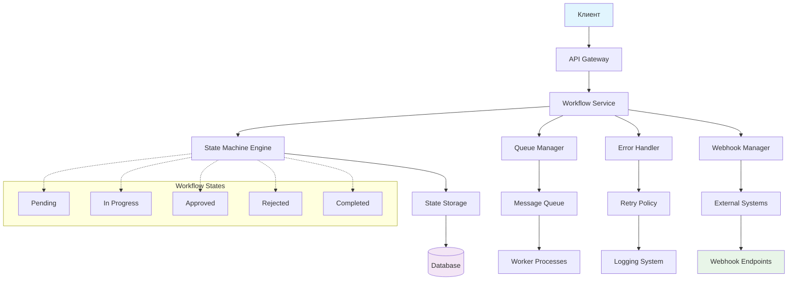

# Диаграмма архитектуры Workflow системы

## Описание компонентов

- **Клиент**: Инициирует workflow и получает обновления
- **API Gateway**: Точка входа для API запросов
- **Workflow Service**: Основной оркестратор workflow
- **State Machine Engine**: Управляет состояниями и переходами
- **Queue Manager**: Обрабатывает асинхронные задачи
- **Error Handler**: Управляет ошибками и retry логикой
- **Webhook Manager**: Отправляет уведомления внешним системам
- **State Storage**: Хранит текущие состояния workflow
- **Message Queue**: Очередь для асинхронных операций
- **Worker Processes**: Фоновые процессы для обработки задач
- **Retry Policy**: Политика повторных попыток
- **Logging System**: Система логирования
- **External Systems**: Внешние сервисы, получающие webhook

## Поток данных

1. Клиент отправляет запрос на запуск workflow
2. API Gateway перенаправляет в Workflow Service
3. Workflow Service инициализирует State Machine
4. State Machine обновляет состояние в State Storage
5. При асинхронных операциях - задачи в Queue Manager
6. Worker Processes обрабатывают задачи из Message Queue
7. Error Handler управляет сбоями с retry
8. Webhook Manager уведомляет External Systems о событиях
9. Все действия логируются в Logging System