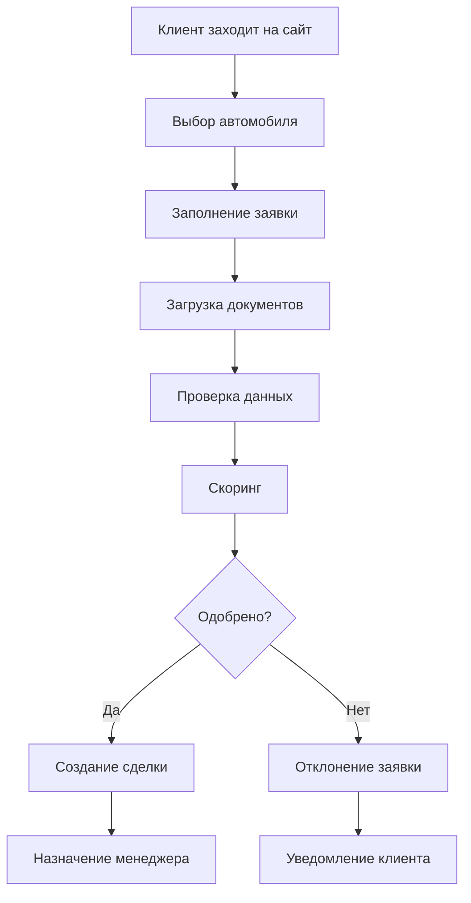

# Схема базы данных FastLease - Детальная документация

## Содержание
1. [Обзор системы](#обзор-системы)
2. [Основные модули](#основные-модули)
3. [Роли и права доступа](#роли-и-права-доступа)
4. [Структура таблиц](#структура-таблиц)
5. [Связи между таблицами](#связи-между-таблицами)
6. [Workflow система](#workflow-система)
7. [Примеры данных](#примеры-данных)
8. [Бизнес-процессы](#бизнес-процессы)

---

## Обзор системы

FastLease - это комплексная лизинговая платформа, построенная на архитектуре микросервисов с использованием Supabase (PostgreSQL) и Next.js. Система обеспечивает полный цикл лизинга автомобилей от подачи заявки до завершения договора.

### Ключевые особенности архитектуры:
- **Мультитенантность**: поддержка множественных организаций и ролей
- **Workflow Engine**: автоматизированное управление процессами сделок
- **Временные метки**: все таблицы имеют автоматические `created_at` и `updated_at`
- **JSONB поля**: гибкое хранение метаданных и дополнительной информации
- **Система аудита**: полное логирование изменений и переходов состояний

---

## Основные модули

### 1. Модуль идентификации и авторизации
- **Профили пользователей**: личная информация, контакты, статус
- **Система ролей**: 10 основных ролей с различными правами доступа
- **Аутентификация**: интеграция с Supabase Auth

### 2. Каталог транспортных средств
- **Автомобили**: основная информация, характеристики, изображения
- **Спецификации**: детальные технические параметры
- **Телеметрия**: данные с датчиков и мониторинг состояния

### 3. Модуль заявок
- **Заявки клиентов**: процесс подачи и рассмотрения заявлений
- **Документооборот**: загрузка и верификация документов
- **Скоринг**: автоматическая оценка рисков

### 4. Модуль сделок
- **Договоры лизинга**: управление жизненным циклом сделок
- **Workflow**: автоматизированные переходы между статусами
- **Задачи**: SLA-ориентированное управление задачами

### 5. Финансовый модуль
- **Инвойсинг**: автоматическая генерация счетов
- **Платежи**: обработка и отслеживание платежей
- **Расписания**: графики платежей и обязательств

### 6. Клиентский портал
- **Поддержка**: система тикетов и общения
- **Уведомления**: персонализированные оповещения
- **Реферальная программа**: отслеживание привлеченных клиентов

### 7. Инвесторский модуль
- **Портфели**: управление инвестиционными портфелями
- **Отчетность**: автоматическая генерация отчетов
- **Performance tracking**: отслеживание доходности

---

## Роли и права доступа

| Роль | Код | Описание | Домашняя страница |
|------|-----|----------|-------------------|
| **Администратор** | ADMIN | Полный доступ к настройкам и пользователям | `/admin/dashboard` |
| **Операционный менеджер** | OP_MANAGER | Управление сделками и задачами | `/ops/dashboard` |
| **Финансы** | FINANCE | Финансовый контроль и платежи | `/finance/dashboard` |
| **Поддержка** | SUPPORT | Клиентская поддержка | `/support/dashboard` |
| **Технический специалист** | TECH_SPECIALIST | Техническая проверка ТС | `/tech/dashboard` |
| **Инвестор** | INVESTOR | Доступ к портфелю и отчетам | `/investor/dashboard` |
| **Клиент** | CLIENT | Личный кабинет клиента | `/client/dashboard` |
| **Риск-менеджер** | RISK_MANAGER | Оценка кредитных рисков | `/risk/dashboard` |
| **Юрист** | LEGAL | Юридическое сопровождение | `/legal/dashboard` |
| **Бухгалтер** | ACCOUNTING | Пост-учет и документооборот | `/accounting/dashboard` |

---

## Структура таблиц

### 1. Система идентификации (Core Identity)

#### `profiles`
Профили пользователей с личной информацией
```sql
id: uuid (PK)
user_id: uuid → auth.users(id)
status: user_status ('pending', 'active', 'suspended', 'archived')
full_name: text
first_name: text
last_name: text
phone: text (unique)
emirates_id: text (unique)
passport_number: text
nationality: text
residency_status: text
date_of_birth: date
address: jsonb ({}'::jsonb)
employment_info: jsonb ({}'::jsonb)
financial_profile: jsonb ({}'::jsonb)
metadata: jsonb ({}'::jsonb)
timezone: text ('Asia/Dubai')
avatar_url: text
last_login_at: timestamptz
created_at: timestamptz (auto)
updated_at: timestamptz (auto)
```

#### `user_roles`
Привязка ролей к пользователям
```sql
id: uuid (PK)
user_id: uuid → auth.users(id)
role: user_role ('CLIENT', 'OPERATOR', 'OP_MANAGER', 'ADMIN', 'INVESTOR', 'FINANCE', 'SUPPORT')
assigned_at: timestamptz (auto)
assigned_by: uuid → auth.users(id)
metadata: jsonb ({}'::jsonb)
created_at: timestamptz (auto)
updated_at: timestamptz (auto)
UNIQUE(user_id, role)
```

### 2. Каталог транспортных средств (Vehicles)

#### `vehicles`
Основная информация об автомобилях
```sql
id: uuid (PK)
vin: text (unique)
make: text (обязательно)
model: text (обязательно)
variant: text
year: integer (проверка year >= 1900)
body_type: text
fuel_type: text
transmission: text
engine_capacity: numeric(10,2)
mileage: integer
color_exterior: text
color_interior: text
status: vehicle_status ('draft', 'available', 'reserved', 'leased', 'maintenance', 'retired')
features: jsonb ({}'::jsonb)
created_at: timestamptz (auto)
updated_at: timestamptz (auto)
```

#### `vehicle_images`
Изображения транспортных средств
```sql
id: uuid (PK)
vehicle_id: uuid → vehicles(id) (CASCADE)
storage_path: text (обязательно)
label: text
is_primary: boolean (default false)
sort_order: integer (default 0)
metadata: jsonb ({}'::jsonb)
created_at: timestamptz (auto)
```

#### `vehicle_specifications`
Технические характеристики
```sql
id: uuid (PK)
vehicle_id: uuid → vehicles(id) (CASCADE)
category: text
spec_key: text (обязательно)
spec_value: text
unit: text
sort_order: integer (default 0)
created_at: timestamptz (auto)
```

### 3. Модуль заявок (Applications)

#### `applications`
Заявки на лизинг
```sql
id: uuid (PK)
application_number: text (unique)
user_id: uuid → auth.users(id) (RESTRICT)
vehicle_id: uuid → vehicles(id) (SET NULL)
status: application_status ('draft', 'submitted', 'in_review', 'on_hold', 'approved', 'rejected', 'cancelled', 'converted')
requested_amount: numeric(16,2)
term_months: integer
down_payment: numeric(16,2)
monthly_payment: numeric(16,2)
interest_rate: numeric(8,4)
personal_info: jsonb ({}'::jsonb)
financial_info: jsonb ({}'::jsonb)
employment_info: jsonb ({}'::jsonb)
references_info: jsonb ({}'::jsonb)
scoring_results: jsonb ({}'::jsonb)
risk_assessment: jsonb ({}'::jsonb)
assigned_to: uuid → auth.users(id)
submitted_at: timestamptz
approved_at: timestamptz
rejected_at: timestamptz
rejection_reason: text
created_at: timestamptz (auto)
updated_at: timestamptz (auto)
```

#### `application_documents`
Документы к заявкам
```sql
id: uuid (PK)
application_id: uuid → applications(id) (CASCADE)
document_type: text (обязательно)
document_category: text
original_filename: text
stored_filename: text
storage_path: text
mime_type: text
file_size: integer
checksum: text
status: text
verification_data: jsonb ({}'::jsonb)
uploaded_at: timestamptz (auto)
verified_at: timestamptz
verified_by: uuid → auth.users(id)
```

### 4. Модуль сделок (Deals)

#### `deals`
Договоры лизинга
```sql
id: uuid (PK)
deal_number: text (unique)
company_code: text → deal_companies(code)
application_id: uuid → applications(id) (RESTRICT)
vehicle_id: uuid → vehicles(id) (RESTRICT)
client_id: uuid → auth.users(id) (RESTRICT)
status: deal_status ('draft', 'pending_activation', 'active', 'suspended', 'completed', 'defaulted', 'cancelled')
principal_amount: numeric(16,2)
total_amount: numeric(16,2)
monthly_payment: numeric(16,2)
monthly_lease_rate: numeric(16,2)
term_months: integer
interest_rate: numeric(8,4)
down_payment_amount: numeric(16,2)
security_deposit: numeric(16,2)
processing_fee: numeric(16,2)
contract_start_date: date
contract_end_date: date
first_payment_date: date
contract_terms: jsonb ({}'::jsonb)
insurance_details: jsonb ({}'::jsonb)
assigned_account_manager: uuid → auth.users(id)
activated_at: timestamptz
completed_at: timestamptz
created_at: timestamptz (auto)
updated_at: timestamptz (auto)
```

#### `deal_companies`
Справочник юридических лиц/брендов сделок
```sql
code: text (PK)
name: text (название компании)
prefix: text (префикс в номере сделки, например FLS)
is_active: boolean (default true)
created_at: timestamptz (auto)
```

> **Примечание по нумерации сделок:** человекочитаемые номера формируются по формуле `<prefix>-<DDMMYY>-<VIN4>`, где `prefix` всегда берётся из `deal_companies.prefix`. Любые пользовательские вводы `company_code` нормализуются до допустимого списка (`FLS`, `SND`, `ENT`), а при отсутствии валидного значения система откатывается к дефолтной компании `FLS`. Это гарантирует, что номера сделок и метрики в операционных дашбордах всегда синхронизированы с актуальным справочником компаний.

Поле `insurance_details` хранит структуру страхового полиса и включает ключи:

- `provider` — название страховой компании.
- `policy_number` — номер полиса.
- `policy_type` — тип покрытия (comprehensive, tpl и т.д.).
- `premium_amount` — размер премии (numeric).
- `payment_frequency` — периодичность платежей (`monthly`, `quarterly`, `annual`).
- `next_payment_due` — дата следующего платежа в формате ISO.
- `coverage_start` / `coverage_end` — границы действия полиса.
- `deductible` — франшиза.
- `last_payment_status` — статус последнего платежа.
- `last_payment_date` — дата последнего платежа.
- `notes` — комментарии, контакты брокера и пр.

#### `deal_events`
События по сделкам (аудит)
```sql
id: uuid (PK)
deal_id: uuid → deals(id) (CASCADE)
event_type: text (обязательно)
payload: jsonb ({}'::jsonb)
created_by: uuid → auth.users(id)
created_at: timestamptz (auto)
```

### 5. Финансовый модуль (Finance)

#### `invoices`
Инвойсы и счета
```sql
id: uuid (PK)
invoice_number: text (unique)
deal_id: uuid → deals(id) (CASCADE)
invoice_type: invoice_type ('monthly_payment', 'down_payment', 'processing_fee', 'late_fee', 'insurance', 'buyout')
amount: numeric(16,2) (обязательно)
tax_amount: numeric(16,2) (default 0)
total_amount: numeric(16,2) (обязательно)
currency: text (обязательно, 'AED')
due_date: date (обязательно)
issue_date: date (обязательно, default current_date)
status: invoice_status ('draft', 'pending', 'overdue', 'paid', 'cancelled')
line_items: jsonb ('[]'::jsonb)
tax_breakdown: jsonb ('[]'::jsonb)
payment_terms: text
paid_at: timestamptz
created_at: timestamptz (auto)
updated_at: timestamptz (auto)
```

#### `payments`
Платежи
```sql
id: uuid (PK)
deal_id: uuid → deals(id) (CASCADE)
invoice_id: uuid → invoices(id) (SET NULL)
amount: numeric(16,2) (обязательно)
currency: text (обязательно, 'AED')
status: payment_status ('initiated', 'processing', 'succeeded', 'failed', 'refunded')
method: payment_method ('card', 'bank_transfer', 'cash', 'cheque', 'wallet')
received_at: timestamptz
metadata: jsonb ({}'::jsonb)
created_at: timestamptz (auto)
updated_at: timestamptz (auto)
```

#### `payment_transactions`
Транзакции провайдеров платежей
```sql
id: uuid (PK)
payment_id: uuid → payments(id) (CASCADE)
provider: text
transaction_reference: text (unique)
amount: numeric(16,2)
currency: text (обязательно, 'AED')
status: payment_status ('initiated', 'processing', 'succeeded', 'failed', 'refunded')
payload: jsonb ({}'::jsonb)
processed_at: timestamptz
created_at: timestamptz (auto)
```

#### `payment_schedules`
Графики платежей
```sql
id: uuid (PK)
deal_id: uuid → deals(id) (CASCADE)
sequence: integer (обязательно)
due_date: date (обязательно)
amount: numeric(16,2) (обязательно)
status: invoice_status ('draft', 'pending', 'overdue', 'paid', 'cancelled')
metadata: jsonb ({}'::jsonb)
created_at: timestamptz (auto)
updated_at: timestamptz (auto)
UNIQUE(deal_id, sequence)
```

### 6. Клиентский портал (Client Portal)

#### `support_tickets`
Тикеты поддержки
```sql
id: uuid (PK)
ticket_number: text (unique)
client_id: uuid → auth.users(id) (CASCADE)
deal_id: uuid → deals(id) (SET NULL)
topic: text (обязательно)
priority: support_priority ('low', 'medium', 'high', 'critical')
status: support_status ('open', 'in_progress', 'waiting_client', 'resolved', 'closed')
description: text
attachments: jsonb ('[]'::jsonb)
last_message_at: timestamptz (auto)
last_message_preview: text
created_at: timestamptz (auto)
updated_at: timestamptz (auto)
```

#### `support_messages`
Сообщения в тикетах
```sql
id: uuid (PK)
ticket_id: uuid → support_tickets(id) (CASCADE)
author_id: uuid → auth.users(id) (CASCADE)
body: text (обязательно)
attachments: jsonb ('[]'::jsonb)
created_at: timestamptz (auto)
```

#### `referral_codes`
Реферальные коды
```sql
id: uuid (PK)
client_id: uuid → auth.users(id) (CASCADE)
code: text (обязательно, unique)
share_url: text
created_at: timestamptz (auto)
expires_at: timestamptz
```

#### `referral_events`
События реферальной программы
```sql
id: uuid (PK)
referral_id: uuid → referral_codes(id) (CASCADE)
event_type: referral_event_type ('click', 'application', 'deal')
metadata: jsonb ({}'::jsonb)
occurred_at: timestamptz (auto)
```

#### `client_notifications`
Уведомления клиентов
```sql
id: uuid (PK)
client_id: uuid → auth.users(id) (CASCADE)
title: text (обязательно)
message: text
icon: text
severity: text ('info', 'warning', 'error') (default 'info')
read_at: timestamptz
created_at: timestamptz (auto)
```

#### `vehicle_services`
Сервисное обслуживание ТС
```sql
id: uuid (PK)
vehicle_id: uuid → vehicles(id) (CASCADE)
deal_id: uuid → deals(id) (SET NULL)
service_type: text
title: text (обязательно)
description: text
due_date: date
mileage_target: integer
status: service_status ('scheduled', 'in_progress', 'completed', 'overdue')
completed_at: timestamptz
attachments: jsonb ('[]'::jsonb)
created_at: timestamptz (auto)
updated_at: timestamptz (auto)
```

### 7. Инвесторский модуль (Investor Module)

#### `investors`
Профили инвесторов
```sql
id: uuid (PK)
user_id: uuid → auth.users(id) (CASCADE, unique)
investor_code: text (обязательно, unique)
display_name: text (обязательно)
investor_type: investor_type ('individual', 'institutional', 'fund')
status: investor_status ('active', 'inactive', 'suspended', 'under_review')
total_investment: numeric(16,2) (default 0)
available_funds: numeric(16,2) (default 0)
compliance_status: text
onboarded_at: timestamptz
metadata: jsonb ({}'::jsonb, not null)
created_at: timestamptz (auto)
updated_at: timestamptz (auto)
```

#### `investment_portfolios`
Инвестиционные портфели
```sql
id: uuid (PK)
investor_id: uuid → investors(id) (CASCADE)
portfolio_name: text (обязательно)
portfolio_type: text
total_value: numeric(16,2) (default 0)
allocated_amount: numeric(16,2) (default 0)
available_amount: numeric(16,2) (default 0)
irr_percent: numeric(6,3)
risk_band: text
performance_metrics: jsonb ({}'::jsonb, not null)
metadata: jsonb ({}'::jsonb, not null)
created_at: timestamptz (auto)
updated_at: timestamptz (auto)
```

#### `portfolio_assets`
Активы в портфеле
```sql
id: uuid (PK)
portfolio_id: uuid → investment_portfolios(id) (CASCADE)
deal_id: uuid → deals(id)
vehicle_id: uuid → vehicles(id)
asset_code: text
vin: text
vehicle_make: text
vehicle_model: text
vehicle_variant: text
status: portfolio_asset_status ('in_operation', 'pending_delivery', 'under_review', 'attention_required', 'exited')
irr_percent: numeric(6,3)
last_valuation: numeric(16,2)
last_payout_amount: numeric(16,2)
last_payout_currency: text (default 'AED')
last_payout_date: date
payout_frequency: text
acquisition_cost: numeric(16,2)
contract_start_date: date
contract_end_date: date
metadata: jsonb ({}'::jsonb, not null)
created_at: timestamptz (auto)
updated_at: timestamptz (auto)
```

#### `investor_reports`
Отчеты для инвесторов
```sql
id: uuid (PK)
portfolio_id: uuid → investment_portfolios(id) (CASCADE)
report_code: text (обязательно, unique)
report_type: investor_report_type ('payment_schedule', 'portfolio_yield', 'cash_flow')
period_start: date
period_end: date
format: investor_report_format ('pdf', 'xlsx', 'csv')
status: investor_report_status ('queued', 'processing', 'ready', 'failed')
storage_path: text
send_copy: boolean (default false)
requested_by: uuid → auth.users(id)
generated_at: timestamptz
metadata: jsonb ({}'::jsonb, not null)
created_at: timestamptz (auto)
updated_at: timestamptz (auto)
```

### 8. Система задач (Tasks)

#### `tasks`
Универсальная система задач
```sql
id: uuid (PK)
deal_id: uuid → deals(id) (CASCADE)
type: text (обязательно)
title: text (обязательно)
status: text (обязательно, default 'OPEN')
assignee_role: text
assignee_user_id: uuid → auth.users(id)
sla_due_at: timestamptz
completed_at: timestamptz
sla_status: task_sla_status ('ON_TRACK', 'WARNING', 'BREACHED')
payload: jsonb ({}'::jsonb, not null)
action_hash: text
created_at: timestamptz (auto)
updated_at: timestamptz (auto)
UNIQUE(action_hash) WHERE action_hash IS NOT NULL
```

#### `workflow_task_templates`
Шаблоны задач workflow
```sql
id: uuid (PK)
workflow_version_id: uuid → workflow_versions(id) (CASCADE)
template_id: text (обязательно)
task_type: text (обязательно)
schema: jsonb (обязательно)
default_payload: jsonb ({}'::jsonb, not null)
created_at: timestamptz (auto)
UNIQUE(workflow_version_id, template_id)
```

#### `workflow_task_queue`
Очередь для асинхронного создания задач
```sql
id: uuid (PK)
deal_id: uuid → deals(id) (CASCADE)
transition_from: text
transition_to: text
template_id: text
task_definition: jsonb (обязательно)
context: jsonb
status: text (обязательно, default 'PENDING')
attempts: integer (обязательно, default 0)
action_hash: text (обязательно, unique)
error: text
created_at: timestamptz (auto)
processed_at: timestamptz
```

### 9. Аудит и мониторинг (Audit)

#### `audit_log`
Журнал аудита операций
```sql
id: bigint (GENERATED BY DEFAULT AS IDENTITY, PK)
deal_id: uuid → deals(id) (CASCADE)
actor_user_id: uuid → auth.users(id)
action: text (обязательно)
from_status: text
to_status: text
metadata: jsonb
created_at: timestamptz (auto)
```

---

## Связи между таблицами

### Основные связи (Foreign Keys)

#### Пользователи и роли
- `profiles.user_id` → `auth.users.id` (CASCADE)
- `user_roles.user_id` → `auth.users.id` (CASCADE)

#### Транспортные средства
- `vehicle_images.vehicle_id` → `vehicles.id` (CASCADE)
- `vehicle_specifications.vehicle_id` → `vehicles.id` (CASCADE)

#### Заявки и документы
- `applications.user_id` → `auth.users.id` (RESTRICT)
- `applications.vehicle_id` → `vehicles.id` (SET NULL)
- `application_documents.application_id` → `applications.id` (CASCADE)

#### Сделки и финансы
- `deals.application_id` → `applications.id` (RESTRICT)
- `deals.vehicle_id` → `vehicles.id` (RESTRICT)
- `deals.client_id` → `auth.users.id` (RESTRICT)
- `deal_events.deal_id` → `deals.id` (CASCADE)

#### Инвойсы и платежи
- `invoices.deal_id` → `deals.id` (CASCADE)
- `payments.deal_id` → `deals.id` (CASCADE)
- `payments.invoice_id` → `invoices.id` (SET NULL)
- `payment_transactions.payment_id` → `payments.id` (CASCADE)
- `payment_schedules.deal_id` → `deals.id` (CASCADE)

#### Клиентская поддержка
- `support_tickets.client_id` → `auth.users.id` (CASCADE)
- `support_tickets.deal_id` → `deals.id` (SET NULL)
- `support_messages.ticket_id` → `support_tickets.id` (CASCADE)
- `support_messages.author_id` → `auth.users.id` (CASCADE)

#### Реферальная программа
- `referral_codes.client_id` → `auth.users.id` (CASCADE)
- `referral_events.referral_id` → `referral_codes.id` (CASCADE)
- `referral_deals.referral_id` → `referral_codes.id` (CASCADE)
- `referral_deals.deal_id` → `deals.id` (SET NULL)
- `referral_rewards.referral_id` → `referral_codes.id` (CASCADE)
- `referral_rewards.deal_id` → `deals.id` (SET NULL)

#### Уведомления
- `client_notifications.client_id` → `auth.users.id` (CASCADE)

#### Сервисное обслуживание
- `vehicle_services.vehicle_id` → `vehicles.id` (CASCADE)
- `vehicle_services.deal_id` → `deals.id` (SET NULL)

#### Инвесторский модуль
- `investors.user_id` → `auth.users.id` (CASCADE, UNIQUE)
- `investment_portfolios.investor_id` → `investors.id` (CASCADE)
- `portfolio_assets.portfolio_id` → `investment_portfolios.id` (CASCADE)
- `portfolio_assets.deal_id` → `deals.id`
- `portfolio_assets.vehicle_id` → `vehicles.id`
- `portfolio_performance_snapshots.portfolio_id` → `investment_portfolios.id` (CASCADE)
- `portfolio_activity_events.portfolio_id` → `investment_portfolios.id` (CASCADE)
- `investor_reports.portfolio_id` → `investment_portfolios.id` (CASCADE)
- `investor_reports.requested_by` → `auth.users.id`

#### Система задач
- `tasks.deal_id` → `deals.id` (CASCADE)
- `tasks.assignee_user_id` → `auth.users.id`
- `workflow_task_templates.workflow_version_id` → `workflow_versions.id` (CASCADE)
- `workflow_task_queue.deal_id` → `deals.id` (CASCADE)

#### Аудит
- `audit_log.deal_id` → `deals.id` (CASCADE)
- `audit_log.actor_user_id` → `auth.users.id`

### Индексы для оптимизации

#### Основные индексы
- `idx_profiles_user_id` на `profiles.user_id`
- `idx_profiles_status` на `profiles.status`
- `idx_user_roles_user_id` на `user_roles.user_id`
- `idx_user_roles_role` на `user_roles.role`
- `idx_vehicles_status` на `vehicles.status`
- `idx_vehicles_make_model` на `vehicles.make, model`
- `idx_vehicle_images_vehicle` на `vehicle_images.vehicle_id`
- `uniq_vehicle_primary_image` на `vehicle_images(vehicle_id) WHERE is_primary`
- `idx_vehicle_specifications_vehicle` на `vehicle_specifications.vehicle_id`

#### Индексы заявок
- `idx_applications_user` на `applications.user_id`
- `idx_applications_status` на `applications.status`
- `idx_application_documents_application` на `application_documents.application_id`
- `idx_application_documents_type` на `application_documents.document_type`

#### Индексы сделок
- `idx_deals_client` на `deals.client_id`
- `idx_deals_status` на `deals.status`
- `idx_deal_events_deal` на `deal_events.deal_id`
- `idx_deal_events_type` на `deal_events.event_type`

#### Финансовые индексы
- `idx_invoices_deal` на `invoices.deal_id`
- `idx_invoices_status` на `invoices.status`
- `idx_payments_deal` на `payments.deal_id`
- `idx_payments_invoice` на `payments.invoice_id`
- `idx_payments_status` на `payments.status`
- `idx_payment_transactions_payment` на `payment_transactions.payment_id`
- `idx_payment_transactions_status` на `payment_transactions.status`
- `idx_payment_schedules_deal` на `payment_schedules.deal_id`

#### Клиентские индексы
- `idx_support_tickets_client` на `support_tickets.client_id`
- `idx_support_tickets_status` на `support_tickets.status`
- `idx_support_messages_ticket` на `support_messages.ticket_id`
- `idx_support_messages_author` на `support_messages.author_id`
- `idx_referral_codes_client` на `referral_codes.client_id`
- `idx_referral_codes_code` на `referral_codes.code`
- `idx_referral_events_referral` на `referral_events.referral_id`
- `idx_referral_events_type` на `referral_events.event_type`
- `idx_referral_deals_referral` на `referral_deals.referral_id`
- `idx_referral_rewards_referral` на `referral_rewards.referral_id`
- `idx_client_notifications_client` на `client_notifications.client_id`
- `idx_vehicle_services_vehicle` на `vehicle_services.vehicle_id`
- `idx_vehicle_services_deal` на `vehicle_services.deal_id`

#### Инвесторские индексы
- `idx_investors_user_id` на `investors.user_id`
- `idx_investment_portfolios_investor_id` на `investment_portfolios.investor_id`
- `idx_portfolio_assets_portfolio_id` на `portfolio_assets.portfolio_id`
- `idx_portfolio_assets_status` на `portfolio_assets.status`
- `idx_portfolio_performance_portfolio_id` на `portfolio_performance_snapshots.portfolio_id`
- `idx_portfolio_performance_period` на `portfolio_performance_snapshots.period_start`
- `idx_portfolio_activity_portfolio_id` на `portfolio_activity_events.portfolio_id`
- `idx_portfolio_activity_occurred_at` на `portfolio_activity_events.occurred_at DESC`
- `idx_investor_reports_portfolio_id` на `investor_reports.portfolio_id`
- `idx_investor_reports_status` на `investor_reports.status`

#### Индексы задач
- `tasks_action_hash_key` на `tasks(action_hash) WHERE action_hash IS NOT NULL`
- `tasks_deal_id_idx` на `tasks.deal_id`
- `tasks_status_idx` на `tasks.status`
- `tasks_assignee_user_idx` на `tasks.assignee_user_id`
- `tasks_sla_due_idx` на `tasks.sla_due_at`
- `workflow_task_templates_version_template_idx` на `workflow_task_templates(workflow_version_id, template_id)`
- `workflow_task_queue_status_idx` на `workflow_task_queue.status`

#### Аудит индексы
- `audit_log_deal_id_idx` на `audit_log.deal_id`

---

## Workflow система

### Основные компоненты

#### `workflow_versions`
Версии workflow процессов
```sql
id: uuid (PK)
workflow_id: text (обязательно)
version: text (обязательно)
is_active: boolean (default false)
template: jsonb (обязательно)
created_at: timestamptz (auto)
updated_at: timestamptz (auto)
UNIQUE(workflow_id, version)
```

#### Состояния workflow
Система использует JSONB для хранения сложных workflow конфигураций:

```json
{
  "workflow": {
    "id": "fast-lease-v1",
    "title": "Fast Lease Deal Workflow",
    "entity": "deal",
    "ownerRole": "OP_MANAGER",
    "timezone": "Asia/Dubai"
  },
  "roles": [...],
  "stages": {
    "DOCS_COLLECT": {
      "code": "DOCS_COLLECT",
      "title": "Сбор документов",
      "entryActions": [...],
      "sla": {"maxHours": 24}
    },
    "CONTRACT_PREP": {...},
    "SIGNING_FUNDING": {...},
    "ACTIVE": {...}
  },
  "transitions": [...],
  "permissions": {...}
}
```

### Типы задач workflow

#### 1. Задачи документооборота
- `docs.required.allUploaded` - проверка загрузки всех документов
- `docs.kyc.completed` - завершение KYC проверки

#### 2. Финансовые задачи
- `payments.advanceReceived` - получение авансового платежа
- `payments.supplierPaid` - оплата поставщику
- `finance.approved` - финансовое одобрение

#### 3. Юридические задачи
- `legal.contractReady` - готовность договора
- `esign.allSigned` - подписание всеми сторонами

#### 4. Технические задачи
- `tech.vehicle.inspected` - техническая инспекция ТС
- `delivery.confirmed` - подтверждение доставки

### SLA и эскалация
- **ON_TRACK**: задача выполняется в срок
- **WARNING**: выполнено 80% времени SLA
- **BREACHED**: превышено время SLA

---

## Примеры данных

### Тестовые пользователи

#### Клиент
```sql
-- Amira Client (CLIENT)
email: amira.client@fastlease.dev
phone: +971500000001
role: CLIENT
profile: {
  "full_name": "Amira Client",
  "emirates_id": "784-1987-1234567-1",
  "nationality": "UAE",
  "residency_status": "resident"
}
```

#### Операционный менеджер
```sql
-- Omar Operations (OP_MANAGER)
email: omar.ops@fastlease.dev
phone: +971500000002
role: OP_MANAGER
profile: {
  "full_name": "Omar Operations",
  "nationality": "UAE",
  "residency_status": "resident"
}
```

#### Инвестор
```sql
-- Ilias Investor (INVESTOR)
email: ilias.investor@fastlease.dev
phone: +971500000005
role: INVESTOR
profile: {
  "full_name": "Ilias Investor",
  "nationality": "Greece",
  "residency_status": "resident"
}
```

### Примеры транспортных средств

#### Rolls-Royce Cullinan
```sql
vin: WDC12345678900001
make: Rolls-Royce
model: Cullinan
variant: Black Badge
year: 2024
body_type: SUV
fuel_type: petrol
transmission: automatic
mileage: 1200
status: available
features: {
  "batteryRange": "N/A",
  "color": "Obsidian"
}
```

#### Volvo XC40 Recharge
```sql
vin: YV1H1234567890003
make: Volvo
model: XC40 Recharge
variant: Twin Motor
year: 2024
body_type: SUV
fuel_type: electric
transmission: automatic
mileage: 560
status: available
features: {
  "batteryRange": "450 km",
  "drive": "AWD"
}
```

### Примеры заявок

#### Заявка APP-2025-0001
```sql
application_number: APP-2025-0001
client_id: [amira.client]
vehicle_id: null
status: submitted
requested_amount: 30000.00
term_months: 36
down_payment: 5000.00
monthly_payment: 850.00
interest_rate: 0.0450
personal_info: {
  "employment": "Software Engineer",
  "company": "Tech Corp"
}
financial_info: {
  "creditScore": 725,
  "income": 45000,
  "debt_to_income": 0.3
}
car_preferences: {
  "budget": 30000,
  "usage": "personal"
}
submitted_at: "2025-09-25 10:00:00"
created_at: "2025-09-20 10:00:00"
```

### Примеры сделок

#### LTR-151025-0001 (Rolls-Royce)
```sql
deal_number: LTR-151025-0001
application_id: APP-2025-0001
vehicle_id: [Rolls-Royce Cullinan]
client_id: [amira.client]
status: CONTRACT_PREP
principal_amount: 865000.00
total_amount: 1025000.00
monthly_payment: 29800.00
term_months: 36
interest_rate: 0.0450
down_payment_amount: 195000.00
security_deposit: 85000.00
processing_fee: 5500.00
contract_start_date: "2025-10-15"
contract_end_date: "2027-12-15"
first_payment_date: "2025-10-27"
contract_terms: {
  "grace_days": 5,
  "late_fee": 250,
  "auto_debit": true
}
insurance_details: {
  "provider": "AXA",
  "policy_number": "AXA-ROLLS-2025",
  "policy_type": "comprehensive",
  "premium_amount": 28500,
  "payment_frequency": "monthly",
  "next_payment_due": "2025-11-15",
  "coverage_start": "2025-09-15",
  "coverage_end": "2026-09-14",
  "deductible": 1000,
  "last_payment_status": "paid",
  "last_payment_date": "2025-10-20"
}
assigned_account_manager: [omar.ops]
activated_at: null
created_at: "2025-09-30 10:00:00"
```

### Примеры инвойсов

#### Ежемесячный инвойс
```sql
invoice_number: INV-2025-0001
deal_id: LTR-151025-0001
invoice_type: monthly_payment
amount: 29800.00
tax_amount: 1490.00
total_amount: 31290.00
currency: AED
due_date: "2025-10-27"
issue_date: "2025-10-01"
status: pending
line_items: [
  {
    "description": "Лизинговый платеж за октябрь 2025",
    "quantity": 1,
    "unit_price": 29800.00,
    "total": 29800.00
  }
]
tax_breakdown: [
  {
    "tax_rate": 0.05,
    "tax_amount": 1490.00,
    "taxable_amount": 29800.00
  }
]
```

### Пример тикета поддержки

#### SUP-3051
```sql
ticket_number: SUP-3051
client_id: [amira.client]
deal_id: LTR-151025-0001
topic: Payment question
priority: high
status: in_progress
description: Clarify why upcoming payment shows warning flag.
last_message_at: "2025-10-28 09:30:00"
last_message_preview: "We noticed a warning about payment timing..."
created_at: "2025-10-28 08:00:00"
updated_at: "2025-10-28 09:30:00"
```

#### Сообщения в тикете
```sql
-- Сообщение клиента
author_id: [amira.client]
body: "We noticed a warning about payment timing. Can you confirm if auto-debit will happen on Friday?"
created_at: "2025-10-28 08:00:00"

-- Ответ поддержки
author_id: [sara.support]
body: "Hi Amira! Yes, we pre-scheduled the debit for Friday 18:00 GST to avoid the weekend cut-off."
created_at: "2025-10-28 09:30:00"
```

### Пример реферальной программы

#### Реферальный код
```sql
client_id: [amira.client]
code: ABC123
share_url: "https://fastlease.dev/apply?ref=ABC123"
created_at: "2025-09-15 10:00:00"
```

#### События
```sql
-- Клик по ссылке
event_type: click
metadata: {"source": "whatsapp"}
occurred_at: "2025-10-20 14:30:00"

-- Подача заявки
event_type: application
metadata: {"application_number": "APP-2025-0025"}
occurred_at: "2025-10-22 11:15:00"

-- Закрытие сделки
event_type: deal
metadata: {"deal_number": "LTR-151025-2011"}
occurred_at: "2025-10-28 16:45:00"
```

---

## Бизнес-процессы

### 1. Процесс подачи заявки



### 2. Workflow сделки

#### Статусы сделок:
1. **DOCS_COLLECT** - Сбор документов
2. **CONTRACT_PREP** - Подготовка договора
3. **SIGNING_FUNDING** - Подписание и финансирование
4. **ACTIVE** - Активная сделка
5. **COMPLETED** - Завершенная сделка

#### Ключевые задачи по статусам:

**DOCS_COLLECT:**
- `docs.required.allUploaded` (CLIENT → OP_MANAGER, SLA: 24h)
- `docs.kyc.completed` (OP_MANAGER → RISK_MANAGER, SLA: 48h)

**CONTRACT_PREP:**
- `legal.contractReady` (LEGAL → OP_MANAGER, SLA: 72h)
- `esign.allSigned` (CLIENT → LEGAL, SLA: 168h)

**SIGNING_FUNDING:**
- `payments.advanceReceived` (FINANCE → OP_MANAGER, SLA: 24h)
- `payments.supplierPaid` (FINANCE → ACCOUNTING, SLA: 48h)

### 3. Финансовый процесс

#### Генерация инвойсов
- Автоматическая генерация ежемесячных инвойсов
- Отслеживание просрочек
- Автоматическое начисление пеней

#### Обработка платежей
- Интеграция с платежными провайдерами
- Обработка множественных способов оплаты
- Контроль статусов транзакций

### 4. Сервисное обслуживание

#### Типы сервисов:
- `inspection` - Технический осмотр
- `maintenance` - Плановое ТО
- `repair` - Ремонт
- `telemetry` - Обновление телеметрии

#### SLA для сервисов:
- **scheduled** → **in_progress**: 24 часа
- **in_progress** → **completed**: согласно типу работ

### 5. Инвесторские процессы

#### Формирование портфеля:
1. Создание инвестиционного портфеля
2. Аллокация средств
3. Приобретение активов (сделок)
4. Распределение доходности

#### Отчетность:
- Ежемесячные отчеты по доходности
- Квартальные финансовые отчеты
- Годовые аудиторские отчеты

### 6. Система уведомлений

#### Типы уведомлений:
- **info** - Информационные сообщения
- **warning** - Предупреждения
- **error** - Критические уведомления

#### Каналы доставки:
- В приложении
- Email
- SMS (для критических уведомлений)

---

## Заключение

Данная схема базы данных обеспечивает:

1. **Полный цикл лизинга**: от заявки до завершения договора
2. **Мультиролевость**: поддержка 10 различных ролей пользователей
3. **Автоматизацию**: workflow система с SLA и эскалацией
4. **Финансовый контроль**: полноценный модуль учета и отчетности
5. **Клиентский сервис**: система поддержки и реферальная программа
6. **Инвестиционный модуль**: управление портфелями и отчетностью
7. **Техническое обслуживание**: отслеживание состояния ТС
8. **Аудит и комплаенс**: полное логирование операций

Схема спроектирована с учетом масштабируемости, производительности и гибкости для будущих расширений функциональности.
